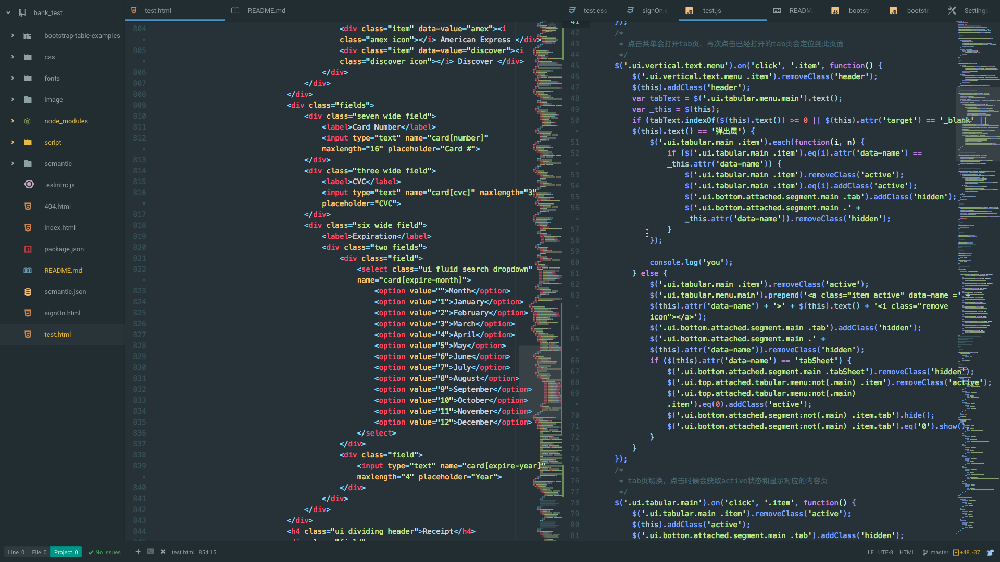
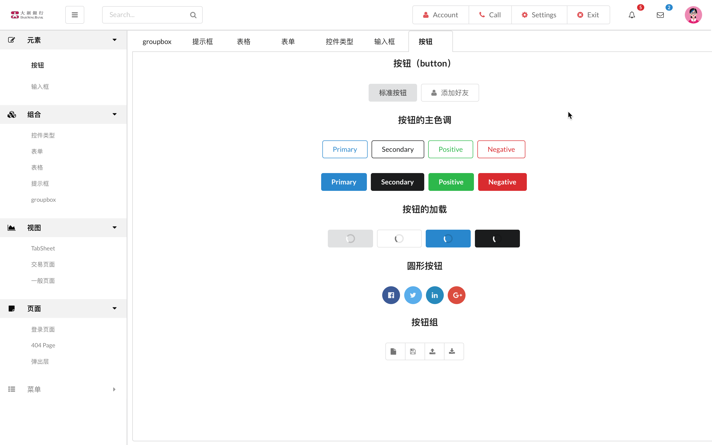
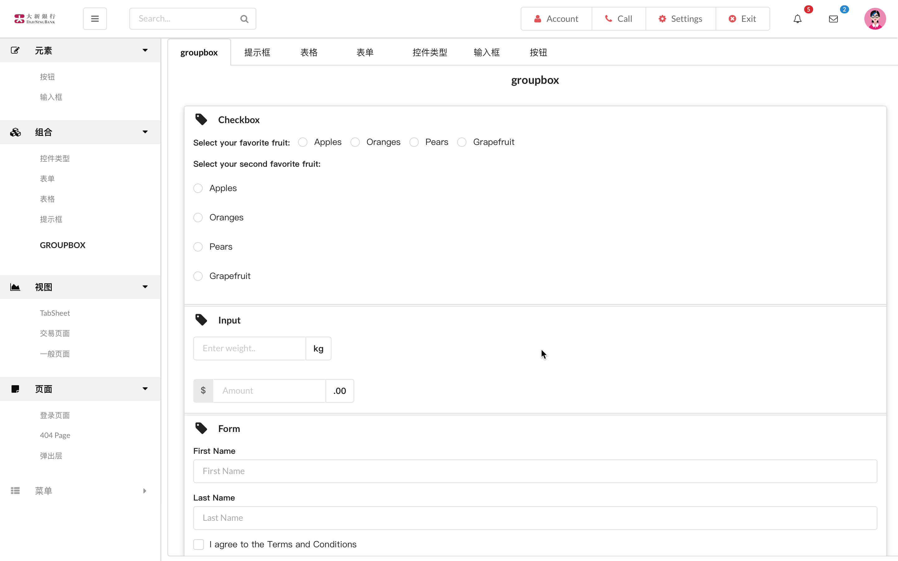
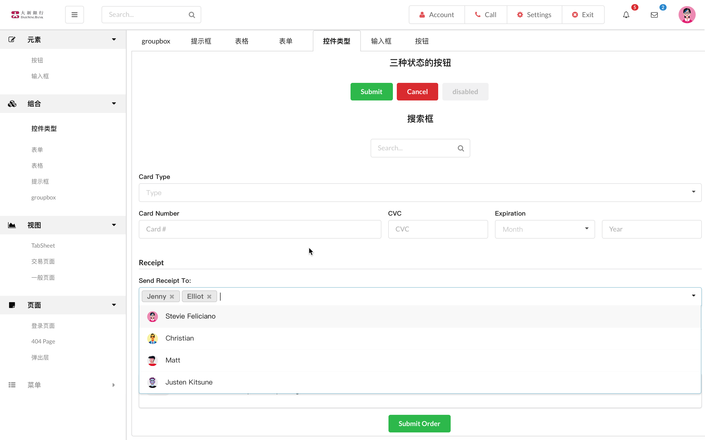
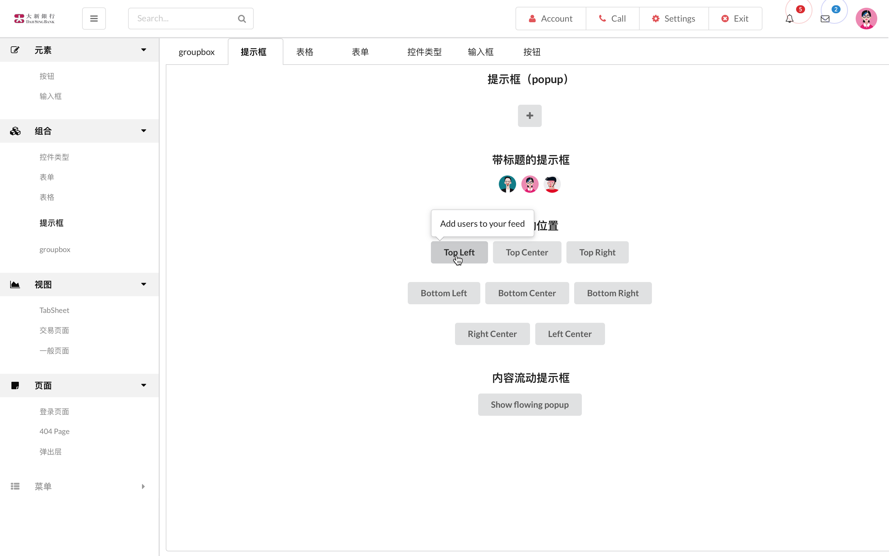
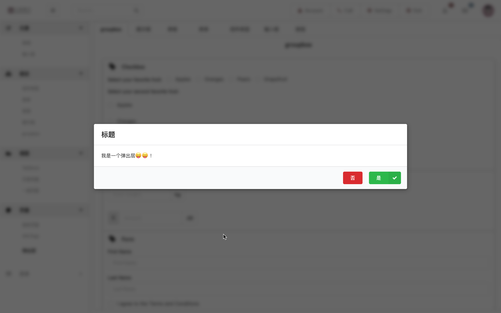
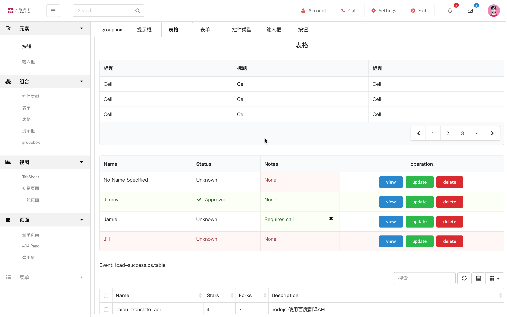
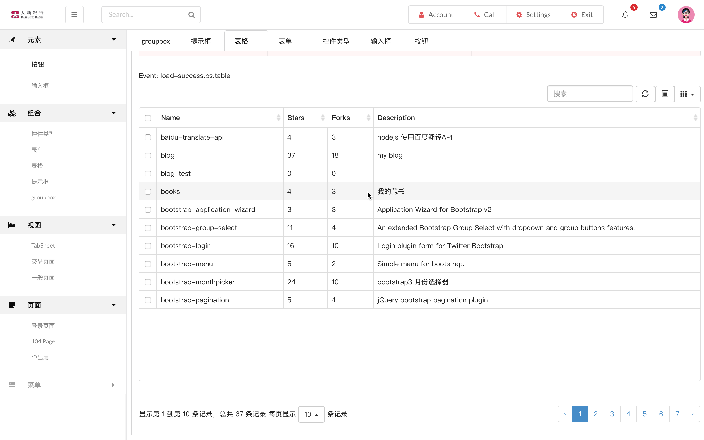

# Semantic-ui bank_test
一个基于semantic-ui和Bootstrap结合编写的银行系统静态页面模型

### 用到的插件有
* Semantic-UI-Calendar插件  是一个很好用的时间插件
* Bootstrap-table插件 表格插件功能非常强大

### Link and Email
* 我的邮箱：<persilee@foxmail.com> Link.<br>

* 我的主页：<http://lishaoy.net> Link.

* Semantic-UI-Calendar插件 <https://jsbin.com/ruqakehefa/> Link.

* Bootstrap-table插件 <http://issues.wenzhixin.net.cn/bootstrap-table> Link.

***
```Html
<link rel="stylesheet" href="./css/bootstrap.min.css">
<link rel="stylesheet" href="./semantic/dist/semantic.min.css">
<link rel="stylesheet" href="./node_modules/semantic-ui-calendar/dist/calendar.min.css">
<link rel="stylesheet" href="./node_modules/bootstrap-table/dist/bootstrap-table.min.css">
<link rel="stylesheet" href="./css/test.css">

```

```javascript
/*
 * 初始化手风琴
 */
$('.ui.accordion').accordion({
    exclusive: false
});
/*
 * 初始化下拉列表
 */
$('select.dropdown').dropdown();
$('.selection.dropdown').dropdown();
/*
 * 初始化复选框和单选框
 */
$('.ui.checkbox').checkbox();

/*
 * 初始化时间插件
 */
$('#example1').calendar();
$('#example2').calendar({
    type: 'date'
});
$('#example3').calendar({
    type: 'time'
});

```
##### Code
> 
>> ##### Button
>> 
>> ##### groupbox
>> 
>> ##### Form
>> 
>> ##### Popup
>> 
>> ##### Modal
>> 
>> ##### Table
>> 
>> ##### SbTable
>> 
